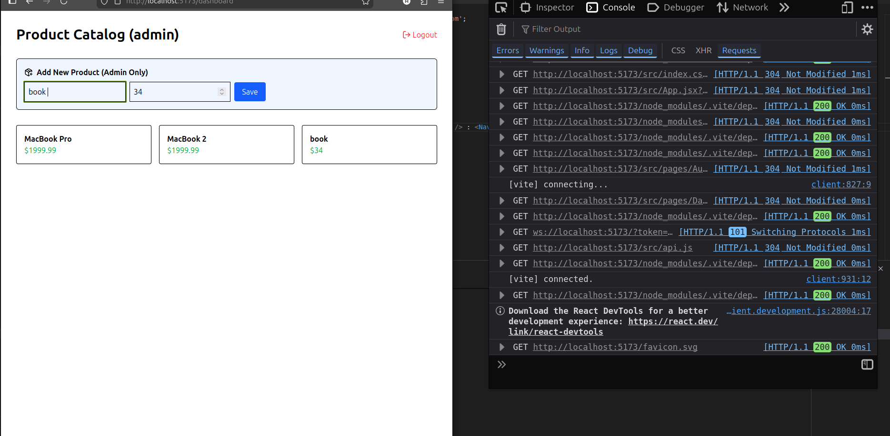

# 🚀 Scalable Ecommerce API & Dashboard
### Backend Developer Intern Assignment Submission (PrimeTrade)

This repository contains a secure, production-grade REST API and a functional UI dashboard. The project is designed with a focus on **Security**, **Modular Architecture**, and **Scalability**—essential for the high-performance demands of the Web3 and trading intelligence space.

---

## 🏗️ Project Overview

The application is split into a high-performance Golang backend and a supportive React.js frontend to demonstrate full-stack integration and Role-Based Access Control (RBAC).

- **Backend:** Golang (Gin), MongoDB, JWT-v5, Bcrypt  
- **Frontend:** React.js (Vite), Tailwind CSS v4, Axios  
- **API Docs:** Postman collection included in `/Docs`

### UI Preview


### Postman Collection Preview


---

## 📈 Technical Note: Scalability & System Design

To transition this MVP into a high-traffic production system:

### 1. Architectural Evolution
While currently a modular monolith, the system is designed to evolve into **microservices** (Identity, Inventory, Orders) communicating via:

- **gRPC** (low-latency synchronous communication)
- **Kafka** (asynchronous event-driven processing)

### 2. Database Scaling
MongoDB enables flexible scaling through:

- **Indexing** (supports $O(1)$ or $O(\log n)$ lookups)
- **Sharding** (horizontal data partitioning)
- **Read Replicas** (to offload read traffic from the primary node)

### 3. Caching & Latency Optimization
To achieve sub-100ms response times:

- **Redis** for caching frequently accessed data (e.g., products, sessions)
- **CDN (Edge Caching)** for static assets and media delivery

---

## ✨ Core Features & Compliance

| Feature | Description |
|--------|------------|
| **Secure Authentication** | Registration & login using Bcrypt hashing and JWT-v5 |
| **RBAC** | Middleware-based role checks (Admin vs User, returns 403 if unauthorized) |
| **API Versioning** | All endpoints are under `/api/v1` for future scalability |
| **CORS Protection** | Restricted to trusted frontend origin (`localhost:5173`) |

---

## 🚀 Quick Start

### 1. Backend Setup
```bash
cd Backend

# Create a .env file with:
# MONGO_URL=<your_mongo_connection_string>
# JWT_SECRET=<your_secret_key>

go mod tidy
go run main.go